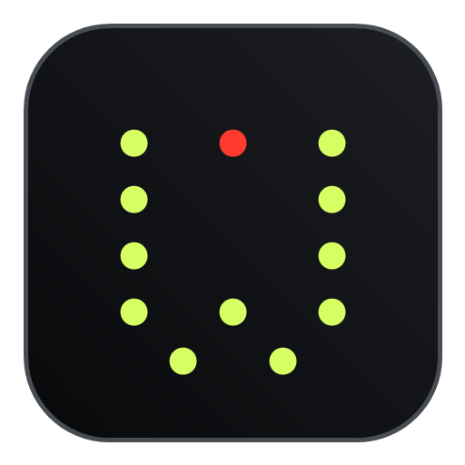
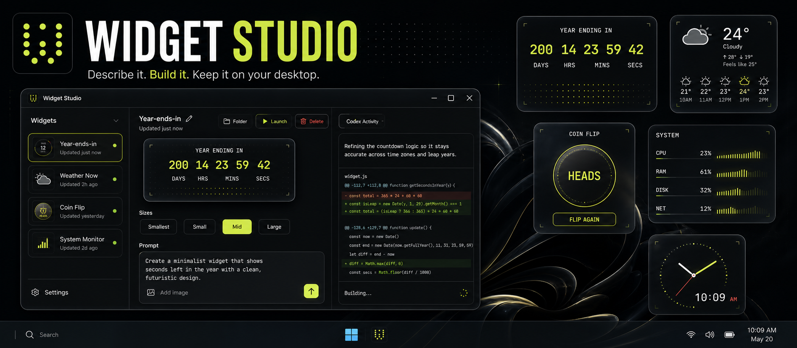
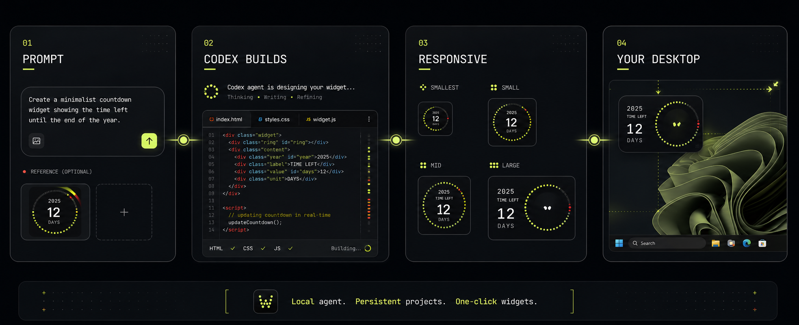

  

  # Widget Studio

  **Describe a widget. Let Codex build it. Keep it on your Windows desktop.**

  
  
  
  

  [**Download Widget Studio**](https://github.com/Wuiserous/widget-studio/releases/latest) | [Report an issue](https://github.com/Wuiserous/widget-studio/issues)

 

> Product visualization of the current Widget Studio experience.

## Turn ideas into desktop widgets

Widget Studio is an AI-powered Windows application that gives your locally installed Codex a focused workspace for building desktop widgets. Describe what you want, optionally attach a visual reference, and watch Codex create, inspect, test, and refine the widget.

Your projects remain editable. Return to any widget later, ask for changes in the same conversation, and launch the updated version directly onto your desktop.

## What you can build

| | |
|---|---|
| **Live information** | Clocks, countdowns, calendars, weather, system stats and trackers |
| **Interactive tools** | Timers, counters, launchers, mini utilities and playful experiments |
| **Your own aesthetic** | Minimal, editorial, industrial, colorful or matched to a reference image |
| **Responsive layouts** | One widget that intelligently adapts across Smallest, Small, Mid and Large |

## Designed for a simple workflow

1. **Describe it** - Write a prompt and paste or attach reference images.
2. **Watch it build** - See Codex's live messages, commands, file edits and validation.
3. **Refine it** - Keep talking to Codex inside the same persistent widget project.
4. **Launch it** - Place the transparent widget on your desktop, drag it, resize it and snap it into position.

## Highlights

- Local Codex Desktop and Codex CLI detection
- Persistent project conversations
- Image references through paste or attachment
- Live observable agent activity and code changes
- Transparent, frameless Windows widget windows
- Screen-edge and neighboring-widget snapping
- Bottom-right resizing
- Responsive information density at four supported sizes
- Managed local widget library
- Project launch, editing and deletion
- Codex usage and rate-limit visibility
- Automatic Widget Studio updates through GitHub Releases

## Install

1. Open the [latest release](https://github.com/Wuiserous/widget-studio/releases/latest).
2. Download `Widget-Studio-Setup-<version>.exe`.
3. Run the installer and open Widget Studio.
4. Install and sign in to [Codex](https://developers.openai.com/codex/) if it is not already available.

Widget Studio automatically discovers Codex installed through the Codex desktop app, PATH or npm. It reuses your existing Codex authentication.

> [!NOTE]
> Windows may show a SmartScreen warning while the installer is unsigned. Verify that the installer came from this repository's official Releases page.

## Local by design

- Widget source files are stored in your local Widget Studio library.
- Codex runs through the installation and account already available on your computer.
- Your private Codex conversations and reference images are not published by Widget Studio.
- Generated widgets run in sandboxed Electron windows without Node.js access.

## Automatic updates

Widget Studio checks the repository's update manifest shortly after startup and periodically while running. When a newer version is available, it:

1. Downloads the release installer from GitHub.
2. Verifies its SHA-256 checksum.
3. Asks before restarting and installing.

You can also use **Settings > Check for updates**.

## Coming next

The next major direction is a community widget library: publish a widget, discover creations from other users, star favorites, track downloads, install with one click and remix with Codex.

## Feedback

Widget Studio is an early independent project. If something breaks or you have an idea that could make widget creation better, [open an issue](https://github.com/Wuiserous/widget-studio/issues).

  Built for Windows. Powered by your local Codex.

